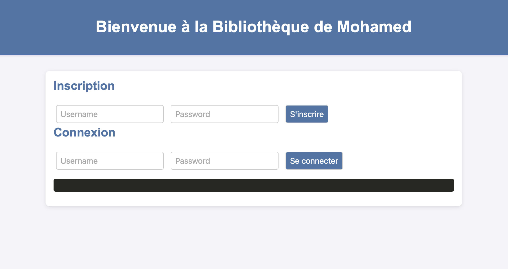
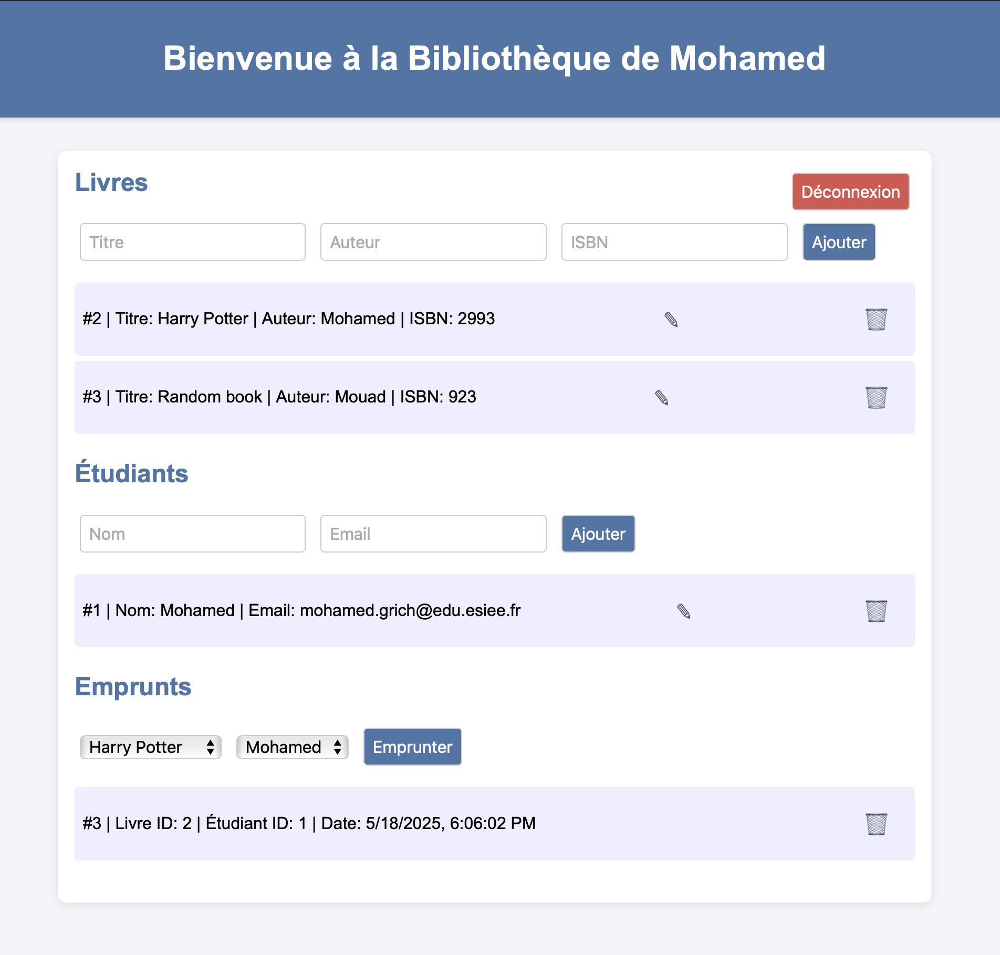

# Sujet : Gestion de librairie
## Par : GRICH Mohamed
Projet de gestion des empreintes de livres pour le rattrapage du module de développement full stack.  
L’application permet de gérer les utilisateurs, les livres, les étudiants et les emprunts via une API sécurisée et un front-end interactif en HTML,CSS et JavaScript.

## Difficultés rencontrées
- **Authentification JWT** : intégration de FastAPI Security et gestion du header `Authorization` plutôt que query param.  
- **Dépendances Docker** : orchestration de plusieurs services (PostgreSQL, FastAPI, Nginx).  
- **Synchronisation front/back** : debug du CORS, du 422 sur endpoints protégés, et gestion des retries. 

## Lancement de l’application
1. Cloner le dépôt et se placer dans le dossier du projet  
2. Lancer la stack Docker :  
   ```bash
   docker-compose up --build
  
3. Accéder au front-end : http://localhost:8080
4. Adminer (DB) : http://localhost:8081
5. Accéder au back-end : http://localhost:8000/docs


## Captures d’écran de l'application

### Page de login


### Page du dashboard

